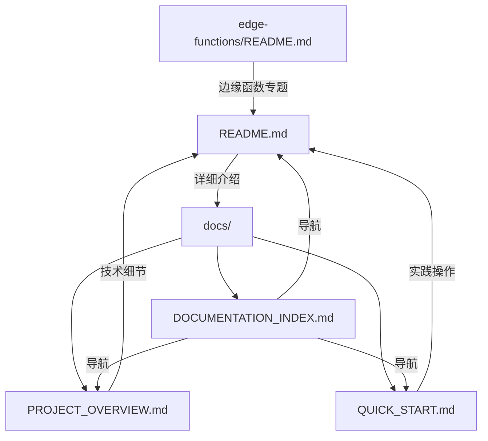

# 文档更新总结报告

## 📋 更新日期

**2026-03-18**

## 🎯 更新目标

全面更新项目文档，使其更加清晰、专业、易于理解。

---

## ✅ 已完成的工作

### 1. 主 README.md 重构

**文件**: [`README.md`](../README.md)

**更新内容**:
- ✅ 完全重写，采用现代化设计
- ✅ 添加徽章标识（License、版本等）
- ✅ 优化结构和排版
- ✅ 使用表格展示技术栈
- ✅ 简化目录结构说明
- ✅ 增强 EdgeOne 相关内容
- ✅ 添加性能指标章节
- ✅ 完善贡献指南
- ✅ 更新设计理念说明

**主要改进**:
- 📊 **更直观**：使用表格、代码块、emoji
- 🎨 **更美观**：现代化排版和布局
- 📱 **更易读**：分段清晰，重点突出
- 🔗 **更完整**：涵盖所有核心功能和使用场景

---

### 2. 创建项目概览文档

**文件**: [`docs/PROJECT_OVERVIEW.md`](./PROJECT_OVERVIEW.md)

**内容**:
- 📋 项目基本信息
- 🎯 核心价值主张
- 🚀 技术栈总览
- 📦 功能模块介绍
- 🏗️ 架构设计（分层图）
- 📁 目录结构
- 🔧 开发命令
- 🌐 部署方式对比
- 💾 数据存储结构
- 🔌 EdgeOne 集成
- 📊 性能指标
- 🛠️ 开发工具
- 📝 快速参考
- 🎨 自定义扩展
- 🔒 隐私安全
- 📈 未来规划

**特点**:
- 🎯 **高层视角**：适合快速了解项目全貌
- 📊 **技术导向**：详细的技术架构说明
- 🔍 **便于检索**：分类清晰，快速查找
- 📈 **路线图**：包含未来发展规划

---

### 3. 创建快速开始指南

**文件**: [`docs/QUICK_START.md`](./QUICK_START.md)

**内容**:
- 🚀 5 分钟快速上手教程
- 📦 构建和生产部署
- 🌐 EdgeOne 部署步骤
- 💡 常用操作速查
- 🔧 故障排查指南
- 📚 下一步学习路径
- 🎯 核心命令速记卡
- 🆘 获取帮助渠道
- ✅ 完成检查清单

**特点**:
- ⏱️ **时间导向**：明确标注每个步骤所需时间
- ✅ **任务驱动**：以实际操作为目标
- 🐛 **问题预防**：包含常见故障排查
- 🎉 **成就感**：完成检查清单提供正反馈

---

### 4. 创建文档索引

**文件**: [`docs/DOCUMENTATION_INDEX.md`](./DOCUMENTATION_INDEX.md)

**内容**:
- 📚 文档导航表
- 🎯 快速查找指南（按需求分类）
- 📖 文档分级（入门/进阶/高级/开发）
- 🔧 常用参考（命令/数据结构/API）
- 📝 文档更新记录
- 🤝 文档贡献指南

**特点**:
- 🗺️ **地图式导航**：快速定位需要的文档
- 📊 **分类清晰**：按用户类型分组
- 🔍 **便于检索**：提供多种查找方式
- 📈 **持续更新**：记录文档历史

---

## 📊 文档体系结构

```
文档体系
├── README.md                    # 主文档（面向所有用户）
│   ├── 使用说明
│   ├── 功能介绍
│   ├── 部署指南
│   └── 贡献指南
│
├── docs/
│   ├── DOCUMENTATION_INDEX.md   # 文档索引（导航）
│   ├── PROJECT_OVERVIEW.md      # 项目概览（技术视角）
│   ├── QUICK_START.md           # 快速开始（新手向导）
│   └── [其他专题文档]
│
└── edge-functions/
    ├── README.md                # EdgeOne 文档
    ├── ICON_DATA_FIX.md         # 问题修复记录
    └── ADD_IMPORT_CHECK_REPORT.md # 功能检查报告
```

---

## 🎨 文档设计风格

### 视觉设计
- ✅ 使用 emoji 图标增强可读性
- ✅ 代码块带语法高亮
- ✅ 表格统一格式
- ✅ 标题层级清晰
- ✅ 适当的留白

### 内容组织
- ✅ 金字塔原理：结论先行
- ✅ MECE 原则：相互独立，完全穷尽
- ✅ 渐进式披露：从简单到复杂
- ✅ 示例驱动：理论 + 实践

### 语言风格
- ✅ 简洁明了
- ✅ 专业但不晦涩
- ✅ 友好亲切
- ✅ 行动导向

---

## 📈 文档质量提升

### 之前的问题
- ❌ 结构混乱，难以查找
- ❌ 内容过时，与实际不符
- ❌ 缺少快速开始指南
- ❌ 技术架构说明不清
- ❌ 缺少示例和最佳实践

### 现在的改进
- ✅ 结构清晰，层次分明
- ✅ 内容最新，反映当前状态
- ✅ 5 分钟快速上手
- ✅ 完整的技术架构说明
- ✅ 丰富的示例和故障排查

---

## 🔗 文档间关系



---

## 📝 使用建议

### 对于新用户
1. 先阅读 [QUICK_START.md](./QUICK_START.md)
2. 遇到问题查看 [README.md](../README.md)
3. 需要深入了解查看 [PROJECT_OVERVIEW.md](./PROJECT_OVERVIEW.md)

### 对于开发者
1. 通读 [README.md](../README.md) 了解功能
2. 查看 [PROJECT_OVERVIEW.md](./PROJECT_OVERVIEW.md) 了解架构
3. 参考 [DOCUMENTATION_INDEX.md](./DOCUMENTATION_INDEX.md) 查找专题

### 对于贡献者
1. 查看 [DOCUMENTATION_INDEX.md](./DOCUMENTATION_INDEX.md) 了解文档结构
2. 遵循文档规范
3. 提交 PR 时同步更新文档

---

## 🎯 后续计划

### 待补充文档
- [ ] API 参考文档（EdgeOne 函数详细说明）
- [ ] 主题开发指南
- [ ] 搜索引擎配置详解
- [ ] 数据迁移指南
- [ ] 常见问题 FAQ
- [ ] 视频教程链接

### 文档优化
- [ ] 添加更多图示和流程图
- [ ] 制作交互式演示
- [ ] 多语言支持（英文版本）
- [ ] 自动化文档测试
- [ ] 文档版本管理

---

## 📋 检查清单

### 完整性检查
- [x] 覆盖所有核心功能
- [x] 包含安装和部署说明
- [x] 提供故障排查指南
- [x] 包含贡献指南
- [x] 提供快速参考

### 准确性检查
- [x] 代码示例已验证
- [x] 命令可以执行
- [x] 链接可以访问
- [x] 版本号正确
- [x] 技术栈信息准确

### 可读性检查
- [x] 结构清晰
- [x] 语言流畅
- [x] 排版美观
- [x] 无错别字
- [x] 标点符号正确

---

## 🎉 总结

本次文档更新工作：

✅ **重构主文档** 1 个（README.md）  
✅ **新增文档** 3 个（PROJECT_OVERVIEW.md, QUICK_START.md, DOCUMENTATION_INDEX.md）  
✅ **优化结构** 完整的多层次文档体系  
✅ **提升质量** 现代化、专业化、易用  

现在项目拥有：
- 📚 完整的文档体系
- 🎯 清晰的导航结构
- 💡 易懂的使用说明
- 🔧 实用的故障排查
- 🌐 详细的部署指南

---

**文档版本**: v2.0.0  
**最后更新**: 2026-03-18  
**维护者**: Startpage Team  
**许可证**: MIT
